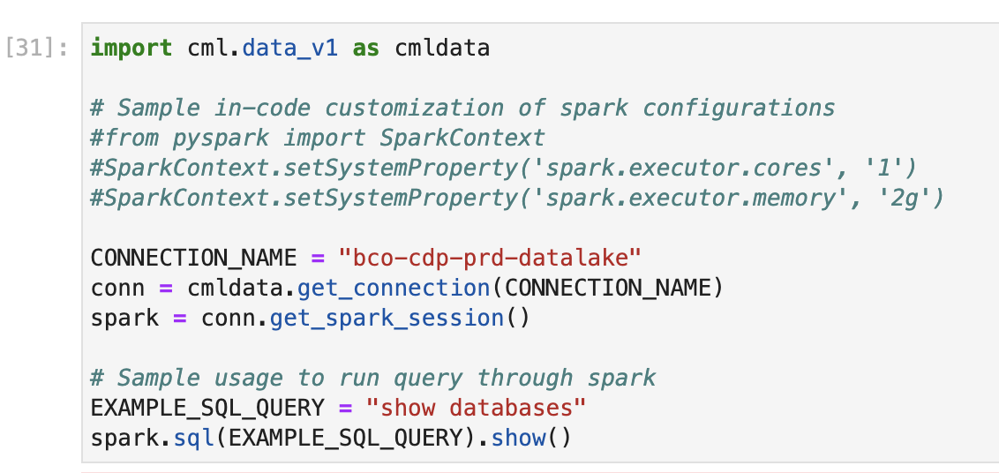

# CML Introduction

Cloudera Machine Learning (CML) is Cloudera’s cloud-native machine learning platform built for CDP. Cloudera Machine Learning unifies self-service data science and data engineering in a single, portable service as part of an enterprise data cloud for multi-function analytics on data anywhere.

It empowers organizations to build and deploy machine learning and AI capabilities for business at scale, efficiently and securely, anywhere they want. It’s built for the agility and power of cloud computing, but isn’t limited to any one cloud provider or data source.


### CML at a Glance

CML is a comprehensive platform to collaboratively build and deploy machine learning capabilities at scale.

Cloudera Machine Learning provides benefits for each type of user.

##### Data Scientists

* CML Enables DS teams to collaborate and speed model development and delivery with transparent, secure, and governed workflows

* With CML, DS teams can expand AI use cases with automated ML pipelines and an integrated and complete production ML toolkit

* CML enables faster decision making and trust with end-to-end visibility and auditability of data, processes, models, and dashboards

##### IT Teams

* CML increases DS productivity with visibility, security, and governance of the complete ML lifecycle

* It eliminate silos, blindspots, and the need to move/duplicate data with a fully integrated platform across the data lifecycle.

* CML accelerates AI with self-service access and containerized ML workspaces that remove the heavy lifting and get models to production faster

##### Business Users

* CML provides access to interactive Applications built and deployed by DS teams.

* Analysts are empowered with predictive insights to more intelligently make business decisions.


### CML Key Capabilities

Cloudera Machine Learning covers the end-to-end machine learning workflow, enabling fully isolated and containerized workloads - including Python, R, and Spark-on-Kubernetes - for scale-out data engineering and machine learning with seamless distributed dependency management.

* Sessions enable Data Scientists to directly leverage the CPU, memory, and GPU compute available across the workspace, while also being directly connected to the data in the data lake.

* Experiments enable Data Scientists to run multiple variations of model training workloads, tracking the results of each Experiment in order to train the best possible Model.

* Models can be deployed in a matter of clicks, removing any roadblocks to production. They are served as REST endpoints in a high availability manner, with automated lineage building and metric tracking for MLOps purposes.

* Jobs can be used to orchestrate an entire end-to-end automated pipeline, including monitoring for model drift and automatically kicking off model re-training and re-deployment as needed.

* Applications deliver interactive experiences for business users in a matter of clicks. Frameworks such as Flask and Shiny can be used in development of these Applications, while Cloudera Data Visualization is also available as a point-and-click interface for building these experiences.


### Cloudera Data Platform (CDP)

Cloudera Data Platform (CDP) is an enterprise data cloud, which functions as a platform for both IT and the business. It incorporates support for an environment running both on on-premises and in a public cloud setup.

CDP also has multi-cloud and multifunction capabilities at the same time as it’s both simple to use and secure by design. It supports both manual and automated functions and is open and extensible. It offers a common environment for both data engineers and data scientists, supporting data science team collaboration.

The data platform from Cloudera provides self-service access to integrated, multi-function analytics on centrally managed and secured business data while deploying a consistent experience anywhere — on-premises or in hybrid and multi-cloud. This includes consistent data security, governance, lineage, and control, while deploying the efficient, easy-to-use cloud analytics, eliminating end-user need for shadow IT solutions.

* Secure By Design: every bit of the architecture and infrastructure of your platform and application is built with security as a primary consideration.

* Track and Audit Everything: CDP provides centralized lineage across datsets, users, and machine learning models, so enterprises can explain every aspect of the use case lifecycle.

* Aligned Practices across Environments: implementing common and consistent practices for the management of multiple cloud environments result in lower operational costs and enhanced security practices.


### Lab Instructions

In this introductory session, you will become familiar with CML Projects, Runtimes, Sessions, and Jobs.

* You will use CML Projects to quickly upload data science artifacts such as development scripts and datasets, and isolate your work from others.

* With CML Runtimes, you will be able to quickly install Python packages, deploy Spark distributed applications without cumbersome installations, and isolate your dependencies from other containers.

* Using CML Sessions, you will deploy the container and all installed packages in the Runtime so that you can interact with your data and code iteratively.

* Using CML Jobs, you will deploy your code as a batch job and optionally schedule new executions.

##### Project Deployment

Copy the git repository URL to your clipboard and enter it in the Project Creation form:


Add two Python 3.9 based runtimes, one with JupyterLab and the other with Workbench Editors. Select any edition that is available in your CML Workspace.


Enter the project and familiarize yourself with the files that have been cloned automatically for you.


##### Session Deployment and Package Installation

Launch a CML Session with the following Runtime options:

```
Editor: JupyterLab
Kernel: Python 3.9
Edition: Standard
Version: 2023 o 2024
Enable Spark: Spark 3.2
Resource Profile: 2 CPU / 4 GB Mem / 0 GPU
```


After a few moments, the JupyterLab Notebook interface will open. Execute each cell with "Shift-Enter". No code changes are required.


Note that the Notebook includes some examples of "pip install" commands. With these, Python packages are downloaded into the Project's Runtime. If you close your session and come back later, those packages will still be installed in your Project.

Your CML Project is, in fact, your private Python environment for data exploration and model development, without the hassle of complex installations and dependency management.

##### Notebook Execution

Continue executing the cells in each Notebook. Detailed instructions are provided to continue in each Notebook.

* The rest of Notebook 1 focuses on some simple commands and the creation of a project environment variable.


* Notebook 2 provides an introduction to Spark-on-Kubernetes and Data Connections in CML. With CML, you can easily deploy CML Sessions with Spark to analyze data and create models at scale. Data Connections provide pre-defined code to connect to different types of data sources, including deploying a Spark Session within your Notebook.





* Notebook 3 provides an introduction to Apache Iceberg in CML. Iceberg is a table format that enables Lakehouse-style analytics on your data. In the context of machine learning, it's beneficial because it allows you to switch between different versions of your data by including a timestamp or Snapshot ID in your query.


Stop after executing Notebook 3 and continue with the next section on CML Jobs.


##### CML Job Execution

CML Jobs allow you to deploy scheduled executions of your code without the hassle of opening a session. They are ideal for use cases involving repeated code execution, such as Data Engineering or Model Inference. The Jobs page provides additional visibility features to monitor execution.

Navigate to the Jobs page and create a Job with the script "04_datagen.py". Then, execute it.

```
Name: DataGen - username
Script: 04_datagen.py
Enable Spark: 3.2
Schedule: Manual
Resource Profile: 2 CPU / 8 GB Mem
```


This job has created a synthetic dataset with geospatial data. Once you have executed the Job, reopen the CML Session and run the remaining Notebooks. You will use the new dataset there.


### Summary

In this first session, you started from the basics of CML. You created your first project and session to explore your data in an isolated environment with your own Python packages. Then, you created a job to isolate a more complex script in a separate execution and allocate more resources to it. In conclusion:

* CML provides easily scalable infrastructure to meet all your needs, from development to production.

* In the CML Workspace, there are three roles: MLWorkspaceAdmin, MLWorkspaceBusinessUser, MLWorkspaceUser. Typically, data scientists are assigned the MLWorkspaceUser role, administrators are assigned the MLWorkspaceAdmin role, and analysts are assigned the MLWorkspaceBusinessUser role.

* Each user deploys their Project to work in an isolated environment that includes Runtime, data, and private files. However, each user has the option to share their work with others by inviting them to their project or by directly changing the project configuration to public.

* Sessions provide an interactive environment for data exploration, research, and model development. When the user opens a session, they can decide which runtime to use. The consequence of this flexibility is that users can select the most suitable execution environment for their specific needs, allowing them to optimize their productivity and performance.

* Jobs allow users to orchestrate and schedule independent or dependent executions. Typical use cases include Spark ETL jobs and batch scoring.

* Spark is one of the leading frameworks for large-scale ETL and machine learning. CML provides the Spark Runtime Add-On capability to use Spark in a session without advanced installations, and Spark Data Connections to deploy a SparkSession with recommended configurations, such as JAR files and other Iceberg settings.

* Apache Iceberg is an open table format designed for secure and efficient storage of large datasets on distributed data storage platforms like Apache Hadoop and Apache Spark. Iceberg facilitates the creation of a data lake model (Lakehouse) by allowing version management and snapshotting of data, making it ideal for large-scale data analytics applications.
